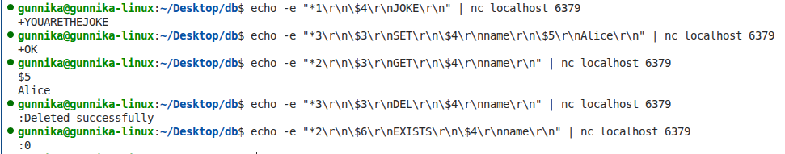
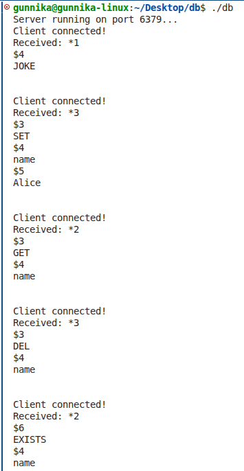

# db — In-Memory Key-Value Store

## 1. Problem Statement

Traditional databases store data on disk which makes read and write operations slow.

This project implements a Redis-like in-memory key-value store from scratch in C++ without using any built-in hash map containers.

## 2. Methodology / Algorithm

The system is built in three layers:

Layer 1 - Networking:
A TCP server built using sockets listens on port 6379. It accepts client
connections, reads raw data from the socket, and sends back a response.

Layer 2 - Protocol Parsing:
Incoming data follows the RESP (Redis Serialization Protocol) format. A custom parser reads the raw bytes and converts them into a list of command arguments.
For example for SET name Alice look like:
*3\r\n$3\r\nSET\r\n$4\r\nname\r\n$5\r\nAlice\r\n
The parser extracts ["SET", "name", "Alice"] from this.

Layer 3 - Storage:
A custom hash table stores all key-value pairs in memory. The hash table uses the djb2 algorithm to convert string keys into array indices and handles collisions using separate chaining with linked lists.

## 3. Strategy Used

Hashing with Separate Chaining

The core strategy is hashing — converting a string key into an integer index to achieve near O(1) average case lookup, insertion, and deletion.

djb2 Hash Function:
    start with h = 5381
    for every character c in key:
        h = h * 33 + c
    return h % capacity

Collision Resolution — Separate Chaining:
When two keys hash to the same index, they are stored as a linked list at that bucket. Each node in the list holds the key, value, and a pointer to the next node.

## 4. Data Structures Used

Node (Linked List Node):
    - string key
    - string value
    - Node* next

HashTable:
    - Node** bucket  (array of linked list heads)
    - int cap        (current capacity, starts at 16)
    - int numberKeys (count of stored keys)

Functions implemented:
    - hashFunction(key)     converts string to bucket index
    - set(key, value)       insert or update
    - get(key)              retrieve value
    - dlt(key)              delete a key
    - exist(key)            check if key exists

## 5. Complexity Analysis

Hash Function:
    Time:  O(m) where m = length of key
    Space: O(1)

set(key, value):
    Average Time: O(m) — hash the key + traverse short chain
    Worst Time:   O(m * n) — all n keys collide into one bucket
    Space: O(1) per insertion

get(key):
    Average Time: O(m)
    Worst Time:   O(m * n)
    Space: O(1)

dlt(key):
    Average Time: O(m)
    Worst Time:   O(m * n)
    Space: O(1)

Overall Space Complexity:
    O(n) where n = number of keys stored

## 6. Code

To run this project on your machine:

Requirements:
- Linux or macOS
- g++ compiler
- netcat (nc) for testing

Build and start the server:

    g++ server.cpp -o db
    ./db

The server will print:
    Server running on port 6379...

To send commands open a second terminal and use netcat:

JOKE:
    echo -e "*1\r\n\$4\r\nJOKE\r\n" | nc localhost 6379

SET name Alice:
    echo -e "*3\r\n\$3\r\nSET\r\n\$4\r\nname\r\n\$5\r\nAlice\r\n" | nc localhost 6379

GET name:
    echo -e "*2\r\n\$3\r\nGET\r\n\$4\r\nname\r\n" | nc localhost 6379

DEL name:
    echo -e "*3\r\n\$3\r\nDEL\r\n\$4\r\nname\r\n" | nc localhost 6379

EXISTS name:
    echo -e "*2\r\n\$6\r\nEXISTS\r\n\$4\r\nname\r\n" | nc localhost 6379

---

## 7. Output

Expected responses:
    JOKE    → +YOUARETHEJOKE
    SET     → +OK
    GET     → value, Key not Found
    DEL     → :Deleted successfully, Key not Found
    EXISTS  → :Key Exists, Key not Found